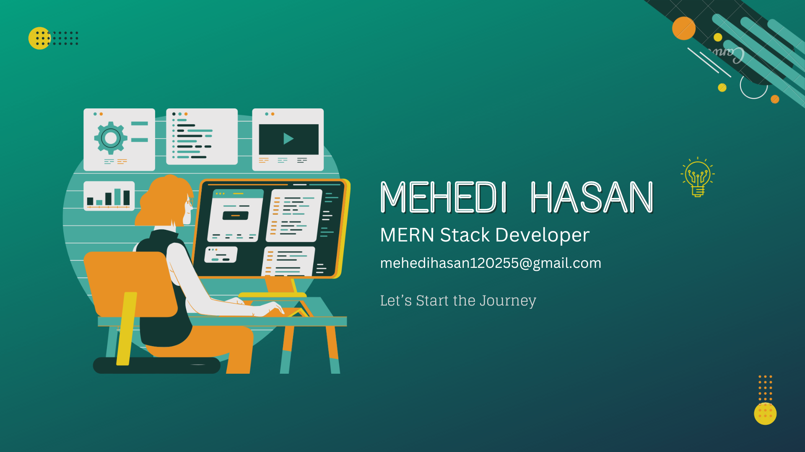

<h1 align="center">Hi, I'm Mehedi Hasan Bayzid</h1>
<h3 align="center">A junior full stack developer from Bangladesh.</h3>

  

- 🔭 I’m currently working on: Beautiful MERN Stack Project which is Real Estate Company **Paramount Estates**

- 🌱 I’m currently learning **Next.js**

- 💬 Ask me about **React, Mongodb, node, JavaScript**

- 📫 How to reach me **mehedihasan120255@gmail.com**

<h3 align="left">Connect with me:</h3>

<h3 align="center">Languages and Tools:</h3>

  <a href="https://skillicons.dev">
     
    
  </a>

<h2 align="center">Stats</h2>

  

  
&nbsp;

   

  

